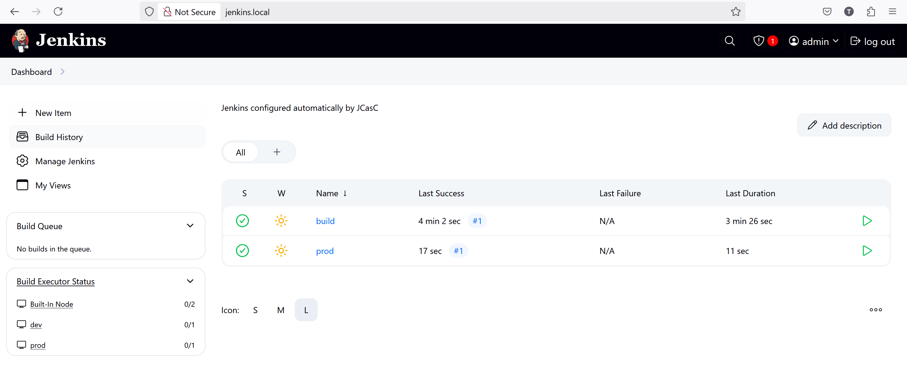
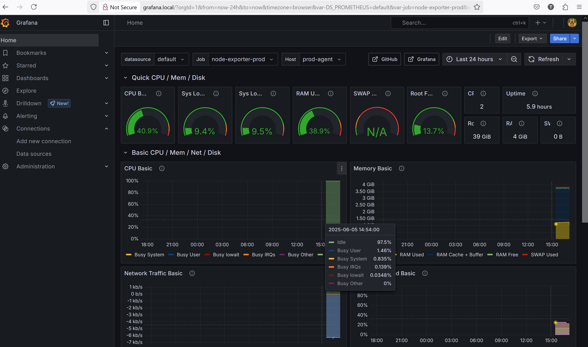

# Jenkins Automation with Vagrant and Docker

This project provisions a fully automated CI/CD and monitoring stack using Vagrant and Docker Compose. It includes Jenkins (with dynamic agent registration), Prometheus, Grafana, and nginx as a reverse proxy.

The infrastructure is containerized and runs inside a Vagrant-powered VirtualBox virtual machine. All services are deployed within this VM, and infrastructure setup must be completed from inside it.

To launch the full stack, SSH into the VM and follow [the instructions](stack/docker/README.md).

If you'd like to run the stack directly on your local machine without Vagrant, simply copy the `stack/docker` directory and place your Jenkins pipelines in `stack/docker/jenkins/jobscripts`.

## Features

* Automated Jenkins setup with Configuration-as-Code
* Dynamic Jenkins agents (dev and prod)
* Node Exporter metrics per agent
* Preconfigured Grafana dashboards for Jenkins and system metrics
* Prometheus alerting rules
* Reverse proxy with nginx

## Requirements

* [Vagrant](https://www.vagrantup.com/)
* [VirtualBox](https://www.virtualbox.org/)

## Usage

```sh
vagrant up
```

Then navigate to:

To access services using hostnames like `jenkins.local` or `grafana.local`, add the following line to your local `/etc/hosts` file (or `C:\Windows\System32\drivers\etc\hosts` on Windows):

```
127.0.0.1 jenkins.local grafana.local prometheus.local dev.local prod.local
```

This will enable clean URLs for Jenkins, Grafana, Prometheus, and your dev/prod application frontends.

* Jenkins: [http://jenkins.local](http://jenkins.local) (admin / admin)
* Prometheus: [http://prometheus.local](http://prometheus.local)
* Grafana: [http://grafana.local](http://grafana.local) (admin / admin)
* Prod application: [http://prod.local](http://prod.local)
* Dev application: [http://dev.local](http://dev.local)

## Screenshots

### Jenkins Dashboard



### Grafana Dashboards



## Project Structure

```
.
│   .gitignore
│   README.md
│   Vagrantfile
│
├───provisioning
│   │   install.sh
│   │
│   └───utils
│           add_hosts.ps1
│           add_hosts.sh
│           remove_hosts.ps1
│           remove_hosts.sh
│
└───stack
    ├───docker
    │   │   docker-compose.yml
    │   │   Makefile
    │   │   README.md
    │   │
    │   ├───grafana
    │   │   ├───dashboards
    │   │   │       jenkins.json
    │   │   │       node-exporter.json
    │   │   │
    │   │   └───provisioning
    │   │       ├───dashboards
    │   │       │       dashboards.yml
    │   │       │
    │   │       └───datasources
    │   │               datasource.yml
    │   │
    │   ├───jenkins
    │   │   │   Dockerfile
    │   │   │   jenkins.yaml
    │   │   │   plugins.txt
    │   │   │
    │   │   ├───agent
    │   │   │       Dockerfile
    │   │   │
    │   │   ├───init.groovy.d
    │   │   │       create-pipelines.groovy
    │   │   │
    │   │   └───jobscripts
    │   │           build.Jenkinsfile
    │   │           prod.Jenkinsfile
    │   │
    │   └───prometheus
    │           alert.rules.yml
    │           prometheus.yml
    │
    └───nginx
            dev.conf
            grafana.conf
            jenkins.conf
            prod.conf
            prometheus.conf
```

## Future Improvements

* Integrate a build artifact repository (e.g., Nexus or Artifactory)
* Add GitHub Webhook integration for Jenkins jobs
* Configure email/Slack alert notifications from Prometheus
* Add HTTPS support with self-signed or Let's Encrypt certificates
* Introduce automated tests for deployed services
* Extend monitoring to include container metrics via cAdvisor

## 📝 License

Anton Zherebtsov, [torinji.san@gmail.com](mailto:torinji.san@gmail.com)
